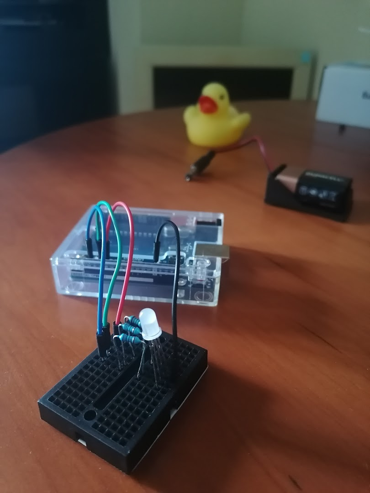

# Microcontrollers -- Crustinopy++

- [Microcontrollers -- Crustinopy++](#microcontrollers----crustinopy)
  - [Intro](#intro)
    - [Windows Setup](#windows-setup)
      - [UNO](#uno)
      - [Pico](#pico)
    - [Linux Setup](#linux-setup)
      - [UNO](#uno-1)
      - [Pico](#pico-1)
    - [Neovim setup](#neovim-setup)
  - [Projects](#projects)
    - [UNO: RGB LED](#uno-rgb-led)


## Intro

<details>

<table style="text-align: center;">
    <thead>
        <tr>
            <th style="text-align: center;">Boards</th>
            <th style="text-align: center;">Arduino UNO</th>
            <th style="text-align: center;"><a href="#">Raspberry Pi Pico</a></th>
        </tr>
    </thead>
    <tbody>
        <tr>
            <td><b>Prog. Lang.</b></td>
            <td>arduino</td>
            <td>arduino + micropython</td>
        </tr>
        <tr>
            <td><b>Dev Tools</b></td>
            <td>
              <s>Arduino IDE</s> | 
              <code>arduino-cli</code>
            </td>
            <td><code>micropy-cli</code></td>
        </tr>
        <tr>
            <td><b>Dev Environment</b></td>
            <td colspan="2">
              Neovim | VSCode
            </td>
        </tr>
        <tr>
          <td><b>MISC.</b></td>
          <td>-</td>
          <td><code>picopins</code></td>
        </tr>
    </tbody>
</table>


<details>
<summary>Documentation</summary>

- **Arduino UNO**
  - kits & project materials
    - [Elegoo UNO Project Basic Starter Kit Tutoria](https://www.elegoo.com/blogs/arduino-projects/elegoo-uno-project-basic-starter-kit-tutorial)
  - dev tools
    - [arduino code reference](https://www.arduino.cc/reference/en)
    - [Everything about arduino code](https://www.circuito.io/blog/arduino-code/)
    - [github.com/arduino/arduino-cli](https://github.com/arduino/arduino-cli)
    - [arduino-cli Getting Started](https://arduino.github.io/arduino-cli/0.34/getting-started/): MyFirstSketch
- **RPi Pico**
  - kits & project materials
    - [SunFounder: Euler Kit for Raspberry Pi Pico](https://docs.sunfounder.com/projects/euler-kit/en/latest/index.html)
  - dev tools
    - [Pico Programming with Arduino IDE](https://randomnerdtutorials.com/programming-raspberry-pi-pico-w-arduino-ide/)
    - micropython: [unix](https://github.com/micropython/micropython/tree/master/ports/unix), [windows](https://github.com/micropython/micropython/tree/master/ports/windows)
- **MISC.**
  - Neovim
    - VSCode: [1](https://devblogs.microsoft.com/cppblog/vscode-embedded-development/), [2](https://spin.atomicobject.com/2019/12/09/vs-code-for-embedded-development/)
    - [github.com/arduino/arduino-language-server](https://github.com/arduino/arduino-language-server), requires [github.com/clangd/clangd](https://github.com/clangd/clangd)

</details>


### Windows Setup

#### UNO

```powershell
# Arduino IDE
winget install arduinoSA.IDE.stable

# arduino-cli
winget install arduinoSA.CLI
Set-Alias acli arduino-cli

acli core update-index    # connect board NOW
acli board list
acli core install arduino:avr; acli core list

acli sketch new SketchName

acli compile --fqbn arduino:avr:uno SketchName
acli upload -p COM3 --fqbn arduino:avr:uno SketchName
```

#### Pico

```powershell
# winget install Microsoft.VisualStudio.2022.BuildTools

# Prep venv
cd ~\Workspace\Microcontrollers
python -m venv venv

# Install them tools
.\venv\Scripts\Activate.ps1
pip install picopins
# pip install micropy-cli
deactivate
```

### Linux Setup

#### UNO

```bash
# Arduino IDE
flatpak install cc.arduino.IDE

# arduino-cli
curl -fsSL https://raw.githubusercontent.com/arduino/arduino-cli/master/install.sh | BINDIR=~/.local/bin sh
sudo useradd -aG dialout $USER  # https://arduino.stackexchange.com/questions/739/arduino-program-only-works-when-run-as-root

alias acli='arduino-cli'

acli core update-index    # connect board NOW
acli board list
acli core install arduino:avr; acli core list

acli sketch new SketchName

acli compile --fqbn arduino:avr:uno SketchName
acli upload -p /dev/ttyACM0 --fqbn arduino:avr:uno SketchName
```


#### Pico


```bash
# Pico stuff
pip install picopins    # ~/.local/bin
pip install micropy-cli
```


### Neovim setup

> WIP

<!-- - Arduino -->

<!-- ```bash
# Linux
acli config init
sudo apt install clang clangd
```
```powershell
# Windows
acli config init
winget install llvm.llvm llvm.clangd
``` -->


<!-- - Micropython -->

---

</details>


## Projects

### UNO: RGB LED


<!--  -->


<!-- ```mermaid
  flowchart LR;
3["~3"] -. blue .-> Resistor
5["~5"] -. green .-> Resistor -. long end .-> RGB[RGB LED] -. short end // black .-> GND
6["~6"] -. red .-> Resistor
``` -->

<br>

```c
// Define Pins
#define BLUE 3
#define GREEN 5
#define RED 6

void setup() {
  pinMode(RED, OUTPUT);
  pinMode(GREEN, OUTPUT);
  pinMode(BLUE, OUTPUT);
  digitalWrite(RED, HIGH);
  digitalWrite(GREEN, LOW);
  digitalWrite(BLUE, LOW);
}

// define variables
int redValue;
int greenValue;
int blueValue;

// main loop
void loop() {
  #define delayTime 10 // fading time between colors

  redValue = 255; // choose a value between 1 and 255 to change the color.
  greenValue = 0;
  blueValue = 0;

  for (int i=0; i<255; i+=1) { // fades out red bring green full when i=255
    redValue -= 1;
    greenValue += 1;
    analogWrite(RED, redValue);
    analogWrite(GREEN, greenValue);
    delay(delayTime);
  }

  redValue = 0;
  greenValue = 255;
  blueValue = 0;

  for (int i=0; i<255; i+=1) { // fades out green bring blue full when i=255
    greenValue -= 1;
    blueValue += 1;
    analogWrite(GREEN, greenValue);
    analogWrite(BLUE, blueValue);
    delay(delayTime);
  }

  redValue = 0;
  greenValue = 0;
  blueValue = 255;

  for (int i=0; i<255; i+=1) { // fades out blue bring red full when i=255
    blueValue -= 1;
    redValue += 1;
    analogWrite(BLUE, blueValue);
    analogWrite(RED, redValue);
    delay(delayTime);
  }
}
```
